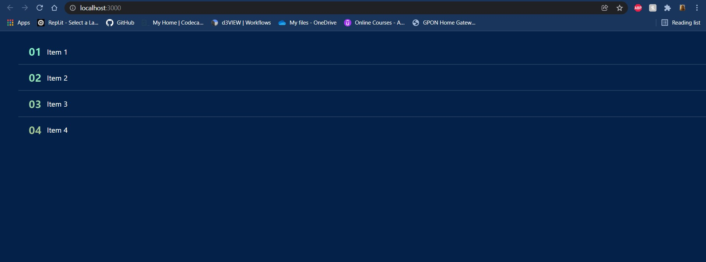

# Symbl.ai

The app was designed to get data from an API and display it in a clean and easy to read format. (Bonus: Dark Theme!)

the sample data was hosted at [MockAPI.com](https://www.mockapi.io/).

# Image of the app

# Features

<ul>
    <li>The app uses useState and fetch() to get and display data from the API
    <li>Until the data is fetched, the app displays a loading message
    <li>If an error occurs, the app displays an error message
</ul>
